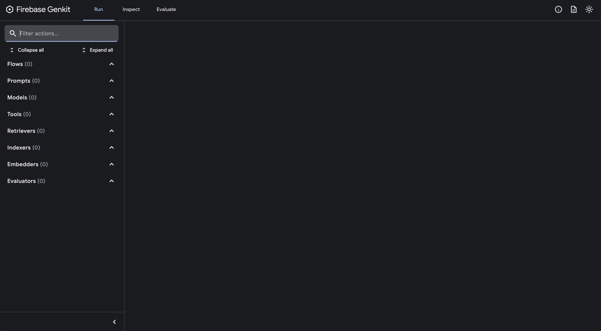
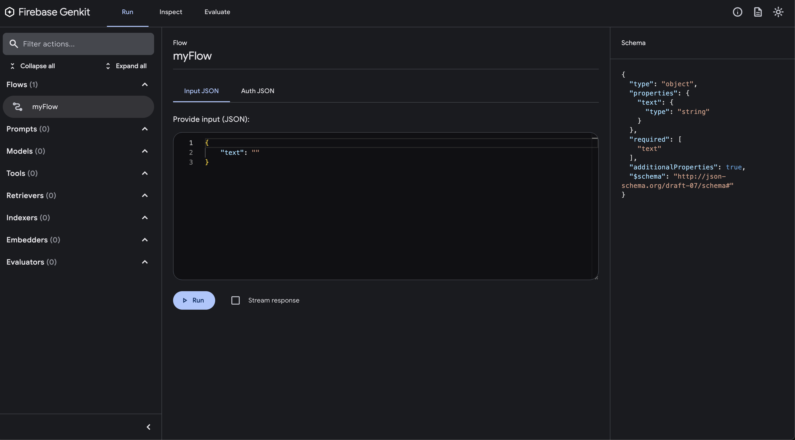
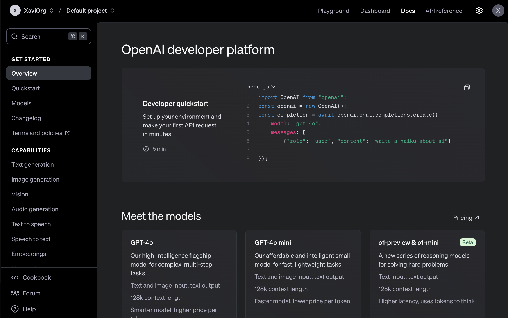
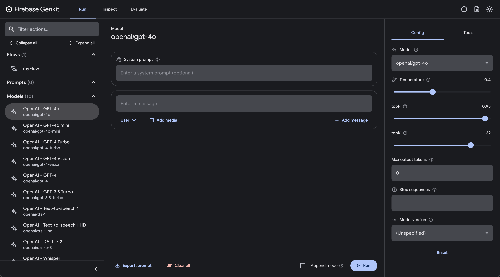
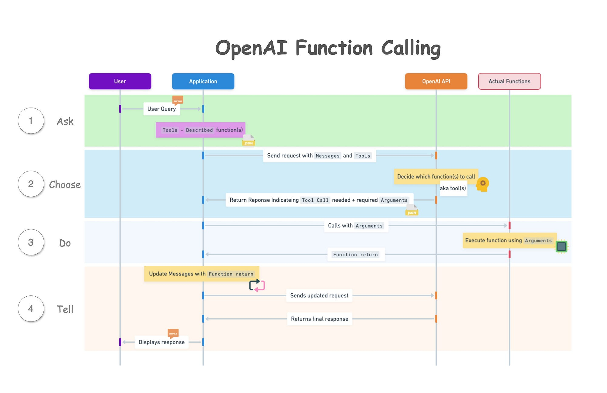
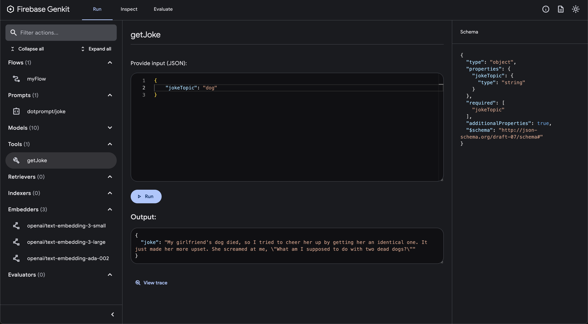
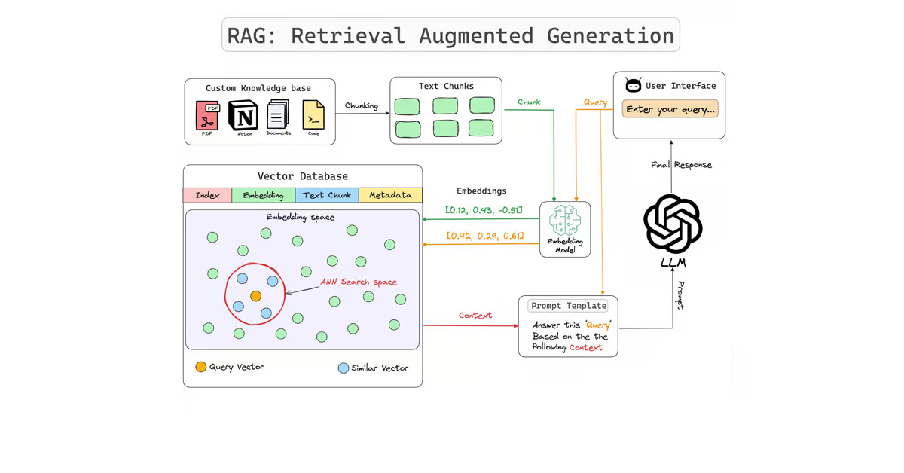
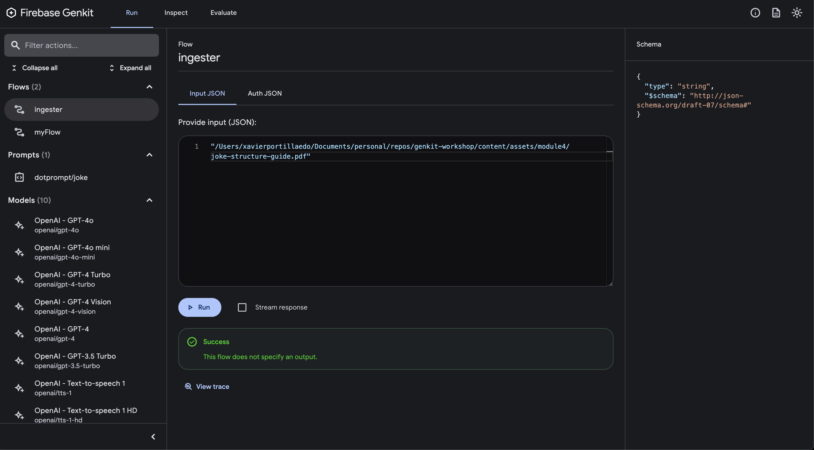
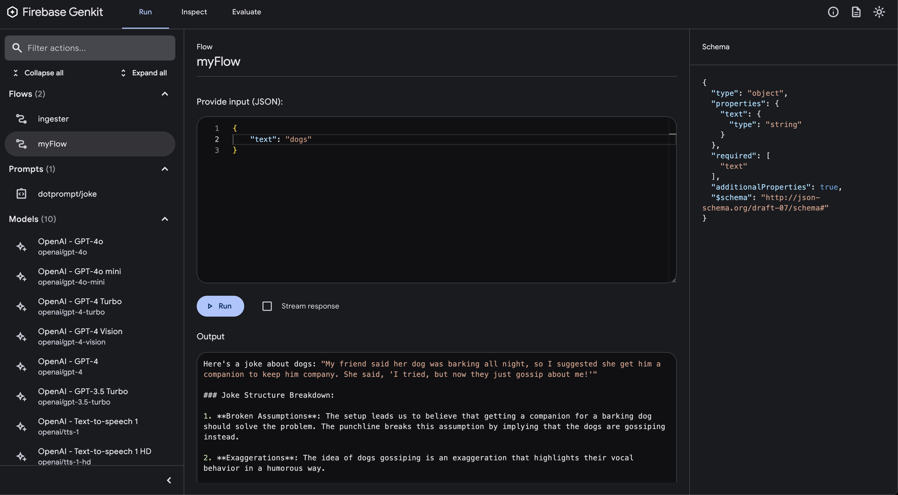
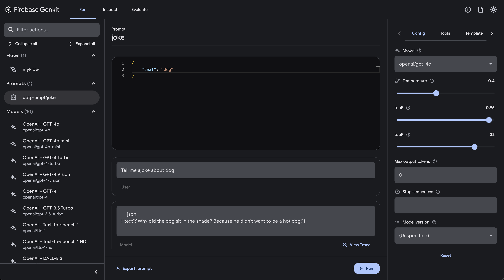

id: genkit-workshop
summary: Introductory workshop to Firebase GenKit
status: Published
authors: Xavier Portilla Edo
Feedback Link: https://github.com/xavidop/genkit-workshop
# Introduction to Firebase GenKit
<!-- ------------------------ -->
## Module 1: Introduction to the framework
Duration: 30
### Overview of Genkit


Firebase Genkit is an open source framework from the Firebase team that allows you to build generative AI applications with ease. It provides a set of plugins and libraries that help you to connect to large language models, manage prompts, create retrieval-augmented generation (RAG) models and many more.

In this workshop, you will learn how to use Genkit to build a simple generative AI application (Firebase function) that can auto-generate jokes based in best practices. You will learn how to connect to a large language model, manage prompts, and talk to your PDF documents.

### Setting Up the Development Environment

Before you get started, let's set up our development environment. These are the tools you need to install for this workshop:
1. Node.js
2. Genkit CLI
3. Firebase CLI

The recommended development environment for Genkit is Node.js. You can download and install Node.js from the [official website](https://nodejs.org/).

To get started with Genkit, you need to install the Genkit CLI and set up a Firebase project. You can do this by following the instructions in the [Genkit documentation](https://firebase.google.com/docs/genkit):
```bash
npm install -g genkit-cli
```

You will also need to install the Firebase CLI and the Firebase emulator suite. You can do this by running the following command:

```bash
npm install -g firebase-tools
```

Before you can use the Firebase CLI, make sure you have a Fireabse account. Once you have create it, you need to log in to your Google account by running the following command:
```bash
firebase login
```


### Intialize our project

Since our application is going to be a Firebase function, you need to create a new Firebase project and initialize it with the Genkit plugin. You can do this by running the following command:

```bash
firebase init genkit
```
When prompted, select the follwing options:
1. **Please select an option:** Create a new project
2. **Genkit's Firebase integration uses Cloud Functions for Firebase with TypeScript. Initialize Functions to continue? (Y/n):** Y
3. **Do you want to use ESLint to catch probable bugs and enforce style? (Y/n):** Y
4. **Do you want to install dependencies with npm now? (Y/n):** Y
5. **Install the Genkit CLI globally or locally in this project?:** Globally
6. **Select a model provider:** None
7. **Would you like to update your tsconfig.json with suggested settings?** Overwrite
8. **Would you like to update your package.json with suggested settings?** Overwrite
9. **Would you like to generate a sample flow?** n

This will create a new Firebase project with the Genkit library initialized. you can now start building your generative AI application.

### Running the Genkit Developer Console

To start the Genkit developer console, run the following command in the root directory of your Firebase project:
```sh
npm run genkit:start
```
You can now access the Genkit developer console at [`http://localhost:4000`](http://localhost:4000). You can use the developer console to interact with your generative AI application and test your prompts and flows:


### Running the Firebase Simulator

To start the Firebase emulator suite, run the following command in the root directory of your Firebase project:
```sh
firebase emulators:start --inspect-functions
```
You can now access the Firebase emulator suite at [`http://localhost:4001`](http://localhost:4001). You can use the emulator suite to test your Firebase functions locally before deploying them to the cloud:


### Solution

You can find the solution to this module in the `code/module1` folder of this [GitHub repository](https://github.com/xavidop/genkit-workshop)

<!-- ------------------------ -->
## Module 2: Hello World with Genkit
Duration: 30

### Creating a Genkit Flow
To create a new Genkit flow, you will to modify the existing code of the `index.ts` file in the `functions/src` directory of your Firebase project.

First, let's add the imports that we will need to create our Genkit flow:

```typescript
import { onFlow, noAuth } from "@genkit-ai/firebase/functions";
import { genkit, z } from "genkit";
import { logger } from 'genkit/logging';
```

This project uses the following Node.js Packages:
1. `@genkit-ai/firebase`: Genkit Firebase SDK to be able to use Genkit in Firebase Functions
2. `genkit`: Genkit AI Core SDK
3. `z`: A TypeScript-first schema declaration and validation library
4. `genkit/logging`: Genkit logging library


Perfect, let's intilize genkit in our project by adding the following code to the `index.ts` file:

```typescript
const ai = genkit({
  model: gpt4o,
  plugins: [],
});
logger.setLogLevel('debug');
```

This code initializes Genkit and sets the log level to debug. One fo the cool is that it is based on a plugin architecture, so you can add more plugins to extend the functionality of Genkit.

You can now create a new Genkit flow by adding the following code to the `index.ts` file:
```typescript
export const myFlow = onFlow(
  ai,
  {
    name: "myFlow",
    inputSchema: z.object({ text: z.string() }),
    outputSchema: z.string(),
    authPolicy: noAuth(),
  },
  async (toProcess) => {
    return toProcess.text;
  },
);
```
In the code above we are creating a new Genkit flow called `myFlow` that takes a text input with the JSON format `{text: 'myText'}` and returns the same text as output.

Let's build our project by running the following command in the `functions` directory:
```sh
npm run build
```

After building the project, let's run the Firebase emulator suite and the Genkit developer console to test our Genkit flow. We should be able to call the `myFlow` flow with the input `{text: 'Hello World'}` and get the output `Hello World`:
```bash
curl -X POST http://localhost:5001/<your-project-id>/<your-region>/myFlow -H "Content-Type: application/json" -d '{"data":{"text":"hi"}}'
```

You should get the following response:
```json
{
  "result": "hi"
}
```

You should see also the flow in the Genkit developer console:


### Connecting to an LLM
Right now, our Genkit flow is just returning the input text as output. Let's connect our Genkit flow to a large language model (LLM) to generate more interesting responses.

For this workshop, we will use the GPT-4o from OpenAI. Please create an account [here](https://platform.openai.com/):
.

Once you have created an account, you will need to create an API key. You can do this by going to the API keys section of the OpenAI platform and clicking on the "Create API Key" button in [Settings > API Keys](https://platform.openai.com/settings). You will need to copy the API key and save it in a secure location.

Once you have your API Key, we can install the OpenAI plugin for Genkit by running the following command in the `function` directory of your Firebase project:
```bash
npm install genkitx-openai
```

Let's import the OpenAI plugin library:
```typescript
import { onFlow, noAuth } from "@genkit-ai/firebase/functions";
import { openAI } from "genkitx-openai";
import { genkit, z } from "genkit";
import { logger } from 'genkit/logging';
```

Then, let's initialize the OpenAI plugin with:
```typescript
const ai = genkit({
  model: gpt4o,
  plugins: [openAI(
    {
      apiKey: <my-api-key>,
    }
  )],
});
logger.setLogLevel('debug');
```

Now, we can create a new Genkit flow that connects to the GPT-4o model by adding the following code to the `index.ts` file:
```typescript
export const myFlow = onFlow(
  ai,
  {
    name: "myFlow",
    inputSchema: z.object({ text: z.string() }),
    outputSchema: z.string(),
    authPolicy: noAuth(), // Not requiring authentication, but you can change this. It is highly recommended to require authentication for production use cases.
  },
  async (toProcess) => {
    const prompt =
    `Tell me a joke about ${toProcess.text}`;

    const llmResponse = await ai.generate({
        prompt: prompt,
        config: {
        temperature: 1,
        },
    });

    return llmResponse.text;
  },
);
```

In the code above, we are creating a re-using the Genkit flow called `myFlow` that takes a text input with the JSON format `{text: 'myText'}` and generates a joke about the input text using the GPT-4o model. We are using the `generate` function from Genkit to generate the response. The `generate` function takes the model, prompt, and configuration as input and returns the generated text.

To use the `generate` function and `gpt4o`, we need to import it them:
```typescript
import { onFlow, noAuth } from "@genkit-ai/firebase/functions";
import { gpt4o, openAI } from "genkitx-openai";
import { genkit, z } from "genkit";
import { logger } from 'genkit/logging';
```

Let's build our project by running the following command in the `functions` directory:
```sh
npm run build
```

Once built, let's run the Firebase emulator suite and the Genkit developer console to test our Genkit flow. We should be able to call the `myFlow` flow with the input `{text: 'dog'}` and get a joke about dogs:
```bash
curl -X POST http://localhost:5001/<your-project-id>/<your-region>/myFlow -H "Content-Type: application/json" -d '{"data":{"text":"dog"}}'
```

You should get a joke about dogs as the response:
```json
{
  "result": "Why did the dog sit in the shade? Because he didn't want to be a hot dog!"
}
```

After installing and configuring the OpenAI plugin, you will be able to interact with the models from the Genkit developer console:


### Solution

You can find the solution to this module in the `code/module2` folder of this [GitHub repository](https://github.com/xavidop/genkit-workshop)

<!-- ------------------------ -->
## Module 3: Tool calling
Duration: 30
### Implement tool calling using Genkit

In the context of large language models (LLMs), a tool or function generally refers to an external utility or operation that the model can call on to extend its abilities beyond just generating text. These tools or functions allow LLMs to perform specialized actions by interfacing with other software, databases, or APIs. LLMs, especially when paired with Genkit, can be programmed to:
1. Recognize the need for a tool or function (e.g., if a user asks for today’s temperature, the LLM might use a weather API).
2. Call the tool or function programmatically (like invoking a calculator API for math or an LLM function to access specific database records).
3. Integrate the response back into the conversation, enhancing the quality of the answers.

In this page from [Tianyi Li](https://towardsdatascience.com/create-an-agent-with-openai-function-calling-capabilities-ad52122c3d12) you can see how tools work:


So let's create a new tool that can retrieve information from a website and uses it to generate a response. For this workshop, we will create a tool that retrieves the current temperature in a city using the OpenWeatherMap API.

```typescript
const getJoke = ai.defineTool(
  {
    name: "getJoke",
    description:
      "Get a randome joke about a specific topic",
    inputSchema: z.object({ jokeTopic: z.string() }),
    outputSchema: z.object({ joke: z.string() }),
  },
  async ({ jokeTopic }) => {
    const response = await fetch(`https://v2.jokeapi.dev/joke/Any?contains=${jokeTopic}`);
    const joke = await response.json();
    return {"joke": joke.joke};
  },
);
```

The tool above is a simple example of a tool that retrieves a joke about a specific topic using the JokeAPI. The tool takes a jokeTopic as input and returns a joke as output. The tool uses the fetch function to make an HTTP request to the JokeAPI and returns the joke as a response.

Let's modify our generate method to use the `getJoke` tool by adding the following code to the `index.ts` file:
```typescript
export const myFlow = onFlow(
  ai,
  {
    name: "myFlow",
    inputSchema: z.object({ text: z.string() }),
    outputSchema: z.string(),
    authPolicy: noAuth(),
  },
  async (toProcess) => {

    const prompt =
    `Tell me a joke about ${toProcess.text}`;

    const result = await ai.generate({
      prompt,
      tools: [getJoke]
    });

    return result.text;
  },
);
```

The code above is using the `generate` function from Genkit to generate a joke about the input text using the GPT-4o model. The `generate` function takes the model, prompt, and tools as input and returns the generated text. In this case, we are passing the `getJoke` tool to the `generate` function to retrieve a joke about the input text.

Make sure you update your imports:
```typescript
import { onFlow, noAuth } from "@genkit-ai/firebase/functions";
import { gpt4o, openAI } from "genkitx-openai";
import { genkit, z } from "genkit";
import { logger } from 'genkit/logging';
```

Let's build our project by running the following command in the `functions` directory:
```sh
npm run build
```

Once built, let's run the Firebase emulator suite and the Genkit developer console to test our Genkit flow. We should be able to call the `myFlow` flow with the input `{text: 'dog'}` and get a joke about dogs:
```bash
curl -X POST http://localhost:5001/<your-project-id>/<your-region>/myFlow -H "Content-Type: application/json" -d '{"data":{"text":"dog"}}'
```

You should get a joke about dogs as the response:
```json
{
  "result": "Here's a joke for you:\n\n\"My girlfriend's dog died, so I tried to cheer her up by getting her an identical one. It just made her more upset. She screamed at me, 'What am I supposed to do with two dead dogs?'\""
}
```

One important thing from the output above is that the joke is generated by the `getJoke` tool and not by the GPT-4o model. This shows that the tool is being called correctly and integrated into the conversation.

You can interact with the tools in the Genkit developer console:


### Solution

You can find the solution to this module in the `code/module3` folder of this [GitHub repository](https://github.com/xavidop/genkit-workshop)

<!-- ------------------------ -->
## Module 4: Retrieval-Augmented Generation (RAG) with Genkit
Duration: 120

### Introduction to Retrieval-augmented generation (RAG)

Retrieval-augmented generation (RAG) is a technique that combines the power of large language models (LLMs) with the ability to retrieve information from a knowledge base. RAG models can generate text by retrieving relevant information from a knowledge base and using it to generate responses. This allows RAG models to generate more accurate and informative responses than LLMs alone. Check this image from [Ramón Rautenstrauch](https://www.consultor365.com/ia/explicacion-rag/):



Genkit supports RAG models by providing a set of plugins and libraries that allow you to create and manage knowledge bases, indexers, and retrievers. You can use Genkit to build RAG models that can generate text by retrieving information from a knowledge base.

For this workshop, we will create a simple RAG model that can generate jokes about a specific topic with a specific structure coming from a knowledge base.

The steps that we will need to do are:
1. Parse the pdf files and create chunks of text.
2. Create an indexer that indexes jokes rules and structure. The indexer will use the chunks, transform them into vectors, and store them in a database.
3. Create a retriever that retrieves jokes from the indexer.

### Parsing documents

Before we proceed, you will need to download this pdf file called `joke-structure-guide.pdf` from [here](https://github.com/xavidop/genkit-workshop/blob/main/content/assets/module4/joke-structure-guide.pdf)

To parse the PDF files and create chunks of text, we will use the `pdf-parse` library and `llm-chunk`. You can install the `pdf-parse` library by running the following command in the `functions` directory of your Firebase project:
```bash
npm install pdf-parse llm-chunk
npm i -D --save @types/pdf-parse
```

Let's create a flow that gets the path of the PDF file and returns the chunks of text by adding the following code to the `index.ts` file:
```typescript
export const ingester = onFlow(
  ai,
  {
    name: "ingester",
    inputSchema: z.string(),
    outputSchema: z.void(),
    authPolicy: noAuth(), // Not requiring authentication, but you can change this. It is highly recommended to require authentication for production use cases.
  },
  async (filepath: string) => {
    const file = path.resolve(filepath);

    // Read the pdf.
    const pdfTxt = await run("extract-text", () => extractTextFromPdf(file));
    const chunkingConfig = {
      minLength: 1000,
      maxLength: 2000,
      splitter: "paragraph",
      overlap: 100,
      delimiters: "",
    } as any;
    // Divide the pdf text into segments.
    const chunks = await run("chunk-it", async () =>
      chunk(pdfTxt, chunkingConfig),
    );

    // Convert chunks of text into documents to store in the index.
    const documents = chunks.map((text) => {
      return Document.fromText(text, { filepath });
    });

  },
);
```

You will need this auxiliar function called `extractTextFromPdf` that reads the PDF file and extracts the text:
```typescript
async function extractTextFromPdf(filePath: string) {
  const pdfFile = path.resolve(filePath);
  const dataBuffer = await readFile(pdfFile);
  const data = await pdf(dataBuffer);
  return data.text;
}
```

The code above is creating a new Genkit flow called `ingester` that takes the path of a PDF file as input and returns the chunks of text as output. The flow reads the PDF file, extracts the text, and divides it into segments/chunks. It then converts the chucks into documents object to store in the index.

One thing that you can see is that we are using the `run` function to run the `extract-text` and `chunk-it` functions. These functions are like steps in a genkit flow.

Make sure you update your imports to include the `run` function:
```typescript
import { genkit, run, z } from "genkit";
import { onFlow, noAuth } from "@genkit-ai/firebase/functions";
import { gpt4o, openAI } from "genkitx-openai";
import { Document } from 'genkit/retriever';
import { chunk } from "llm-chunk";
import { readFile } from "fs/promises";
import pdf from "pdf-parse";
import * as path from "path";
import { logger } from 'genkit/logging';
```

This is how our index.ts file should look like:
```typescript
import { genkit, run, z } from "genkit";
import { onFlow, noAuth } from "@genkit-ai/firebase/functions";
import { gpt4o, openAI } from "genkitx-openai";
import { Document } from 'genkit/retriever';
import { chunk } from "llm-chunk";
import { readFile } from "fs/promises";
import pdf from "pdf-parse";
import * as path from "path";
import { logger } from 'genkit/logging';

const ai = genkit({
  model: gpt4o,
  plugins: [
    openAI({
      apiKey: process.env.OPENAI_API_KEY!,
    }),
  ],
});
logger.setLogLevel('debug');

export const ingester = onFlow(
  ai,
  {
    name: "ingester",
    inputSchema: z.string(),
    outputSchema: z.void(),
    authPolicy: noAuth(), // Not requiring authentication, but you can change this. It is highly recommended to require authentication for production use cases.
  },
  async (filepath: string) => {
    const file = path.resolve(filepath);

    // Read the pdf.
    const pdfTxt = await run("extract-text", () => extractTextFromPdf(file));
    const chunkingConfig = {
      minLength: 1000,
      maxLength: 2000,
      splitter: "paragraph",
      overlap: 100,
      delimiters: "",
    } as any;
    // Divide the pdf text into segments.
    const chunks = await run("chunk-it", async () =>
      chunk(pdfTxt, chunkingConfig),
    );

    // Convert chunks of text into documents to store in the index.
    const documents = chunks.map((text) => {
      return Document.fromText(text, { filepath });
    });

  },
);

async function extractTextFromPdf(filePath: string) {
  const pdfFile = path.resolve(filePath);
  const dataBuffer = await readFile(pdfFile);
  const data = await pdf(dataBuffer);
  return data.text;
}

const getJoke = ai.defineTool(
  {
    name: "getJoke",
    description: "Get a randome joke about a specific topic",
    inputSchema: z.object({ jokeTopic: z.string() }),
    outputSchema: z.object({ joke: z.string() }),
  },
  async ({ jokeTopic }) => {
    const response = await fetch(
      `https://v2.jokeapi.dev/joke/Any?contains=${jokeTopic}`,
    );
    const joke = await response.json();
    return { joke: joke.joke };
  },
);

export const myFlow = onFlow(
  ai,
  {
    name: "myFlow",
    inputSchema: z.object({ text: z.string() }),
    outputSchema: z.string(),
    authPolicy: noAuth(), // Not requiring authentication, but you can change this. It is highly recommended to require authentication for production use cases.
  },
  async (toProcess) => {
    const prompt = `Tell me a joke about ${toProcess.text}.`;

    const result = await ai.generate({
      prompt,
      tools: [getJoke],
    });

    return result.text;
  },
);
```

Let's go back to the image about RAG and see how we can implement the indexer and retriever:


We will need to create an indexer. The indexer will get the chunks from the pdf files, transform them into vectors using embedding models, and store them in a vector database. For this workshop, we will use a local vector database. You can install the local vector database library by running the following command in the `functions` directory of your Firebase project:
```bash
npm install @genkit-ai/dev-local-vectorstore
```

Amazing! Let's initialize the local vector database by adding the following code to the `index.ts` file, it is like another plugin:
```typescript
const ai = genkit({
  model: gpt4o,
  plugins: [
    openAI({
      apiKey: process.env.OPENAI_API_KEY!,
    }),
    devLocalVectorstore([
      {
        indexName: "jokes",
        embedder: textEmbeddingAda002,
      },
    ]),
  ],
});
logger.setLogLevel('debug');
```

In the code above, we are initializing the local vector database with the `devLocalVectorstore` plugin. The plugin takes an array of index configurations as input. Each index configuration contains the index name and the embedder model to use for embedding the text. For this workshop, we are creating an index called `jokes` with the `textEmbeddingAda002` embedder model from OpenAI.

Now, let's create the indexer by adding the following code to the `index.ts` file:
```typescript
export const jokeIndexer = devLocalIndexerRef("jokes");
```

Finally, let's modify the `ingester` flow to index the documents by adding the following code to the `index.ts` file:
```typescript
export const ingester = onFlow(
  ai,
  {
    name: "ingester",
    inputSchema: z.string(),
    outputSchema: z.void(),
    authPolicy: noAuth(), // Not requiring authentication, but you can change this. It is highly recommended to require authentication for production use cases.
  },
  async (filepath: string) => {
    const file = path.resolve(filepath);

    // Read the pdf.
    const pdfTxt = await run("extract-text", () => extractTextFromPdf(file));
    const chunkingConfig = {
      minLength: 1000,
      maxLength: 2000,
      splitter: "paragraph",
      overlap: 100,
      delimiters: "",
    } as any;
    // Divide the pdf text into segments.
    const chunks = await run("chunk-it", async () =>
      chunk(pdfTxt, chunkingConfig),
    );

    // Convert chunks of text into documents to store in the index.
    const documents = chunks.map((text) => {
      return Document.fromText(text, { filepath });
    });

    // Add documents to the index.
    await ai.index({
      indexer: jokeIndexer,
      documents,
    });
  },
);
```

As you can see, we just added the `index` function to the `ingester` flow. The `index` function takes the indexer and documents as input and indexes the documents in the index.

Make sure you update your imports to include the `devLocalIndexerRef` and `index` functions:
```typescript
import { genkit, run, z } from "genkit";
import { onFlow, noAuth } from "@genkit-ai/firebase/functions";
import { gpt4o, openAI, textEmbeddingAda002 } from "genkitx-openai";
import { Document } from 'genkit/retriever';

import {
  devLocalIndexerRef,
  devLocalVectorstore,
} from "@genkit-ai/dev-local-vectorstore";
import { chunk } from "llm-chunk";
import { readFile } from "fs/promises";
import pdf from "pdf-parse";
import * as path from "path";
import { logger } from 'genkit/logging';
```

Let's build our project by running the following command in the `functions` directory:
```sh
npm run build
```

Once built, let's run the Firebase emulator suite and the Genkit developer console to test our Genkit flow. We should be able to call the `ingester` flow with the path of a PDF file and index the documents. Let's call it to index the `joke-structure-guide.pdf` file:


You should see the documents indexed in the local vector database. The local vector database is a json file that stores the vectors of the documents located under the `functions` directory. The json file should be careated automatically and called `__db_jokes.json`.


### Creating a retriever

Now that we have indexed the documents, we can create a retriever that retrieves jokes from the index. The retriever will use the indexed documents to retrieve jokes based on the input text. Let's create a retriever by adding the following code to the `index.ts` file:
```typescript
export const jokeRetriever = devLocalRetrieverRef("jokes");
```

Perfect, let's go you our flow `myFlow`  and modify it to use the `jokeRetriever` by adding the following code to the `index.ts` file:
```typescript
export const myFlow = onFlow(
  ai,
  {
    name: "myFlow",
    inputSchema: z.object({ text: z.string() }),
    outputSchema: z.string(),
    authPolicy: noAuth(),
  },
  async (toProcess) => {
    const prompt = `Tell me a joke about ${toProcess.text}.`;

    const docs = await ai.retrieve({
      retriever: jokeRetriever,
      query: "Joke structure best practices",
      options: { k: 3 },
    });

    console.log(JSON.stringify(docs, null, 2));

    const result = await ai.generate({
      prompt,
      tools: [getJoke],
    });

    return result.text;
  },
);
```

The code above is modifying the `myFlow` flow to use the `jokeRetriever` to retrieve information about jokes structure from the index. The `retrieve` function takes the `retriever`, `query`, and `options` as input and returns the retrieved documents.

If you see the code above, we are not using the `docs` variable, let's add it to the `generate` function:
```typescript
export const myFlow = onFlow(
  ai,
  {
    name: "myFlow",
    inputSchema: z.object({ text: z.string() }),
    outputSchema: z.string(),
    authPolicy: noAuth(), // Not requiring authentication, but you can change this. It is highly recommended to require authentication for production use cases.
  },
  async (toProcess) => {
    const prompt = `Tell me a joke about ${toProcess.text}. Create a joke structure that follows best practices and explain which ones you used.`;

    const docs = await ai.retrieve({
      retriever: jokeRetriever,
      query: "Joke structure best practices",
      options: { k: 3 },
    });

    console.log(JSON.stringify(docs, null, 2));

    const result = await ai.generate({
      prompt,
      tools: [getJoke],
      docs,
    });

    return result.text;
  },
);
```

You can see it added the `context` parameter to the `generate` function. The `context` parameter takes the retrieved documents as input and provides them to the model as context. We have also modified the prompt to test that the context is being used.

Make sure you update your imports to include the `devLocalRetrieverRef` and `retrieve` functions:
```typescript
import { genkit, run, z } from "genkit";
import { onFlow, noAuth } from "@genkit-ai/firebase/functions";
import { gpt4o, openAI, textEmbeddingAda002 } from "genkitx-openai";
import { Document } from 'genkit/retriever';

import {
  devLocalIndexerRef,
  devLocalRetrieverRef,
  devLocalVectorstore,
} from "@genkit-ai/dev-local-vectorstore";
import { chunk } from "llm-chunk";
import { readFile } from "fs/promises";
import pdf from "pdf-parse";
import * as path from "path";
import { logger } from 'genkit/logging';
```

Let's build our project by running the following command in the `functions` directory:
```sh
npm run build
```

Once built, let's run the Firebase emulator suite and the Genkit developer console to test our Genkit flow. We should be able to call the `myFlow` flow with the input `{text: 'dog'}` and get a joke about dogs:


We have successfully created a simple RAG model that can generate jokes about a specific topic with a specific structure using a knowledge base!

### Solution

You can find the solution to this module in the `code/module4` folder of this [GitHub repository](https://github.com/xavidop/genkit-workshop)


<!-- ------------------------ -->
## Module 5: Prompt Management in Genkit
Duration: 30

### Prompt Templates using Dotprompt

Dotprompt is a powerful templating language that allows you to create dynamic prompts for your generative AI applications. You can use Dotprompt to create prompts that include variables, conditions, loops, and more. It uses handlebars-like syntax to define templates and variables.

It is very powerfuls allowing developers to separate the source code from the prompts, making it easier to manage and update the prompts without changing the source code.

Dotprompt is a module included in Genkit flow, you do not need need to install it. You can use it right away:


We can specify where the dotprompt templates are located by adding the following code to the `index.ts` file:
```typescript
const ai = genkit({
  model: gpt4o,
  promptDir: 'prompts',
  plugins: [
    openAI(
    {
      apiKey: process.env.OPENAI_API_KEY!,
    }
  )],
});
logger.setLogLevel('debug');
```

Now, It is time to create the `prompts` folder in the `functions` directory of your Firebase project. This folder will contain the Dotprompt templates for your Genkit flows. You can create a new Dotprompt template by adding a new file with the `.prompt` extension to the `prompts` folder. Let's create a new Dotprompt template called `joke.prompt` with the following content:
```handlebars
---
model: openai/gpt-4o
input:
  schema:
    text: string
    entities: string
    user_input: string
output:
  format: json
  schema:
    text: string
---

Tell me a joke about {{text}}
```

As you see above, the Dotprompt template defines the input and output schema for the prompt template. The prompt template defines the prompt that the Genkit flow uses to generate the response.

Let's modify our flow to use the Dotprompt template by adding the following code to the `index.ts` file:
```typescript
export const myFlow = onFlow(
  ai,
  {
    name: "myFlow",
    inputSchema: z.object({ text: z.string() }),
    outputSchema: z.string(),
    authPolicy: noAuth(), // Not requiring authentication, but you can change this. It is highly recommended to require authentication for production use cases.
  },
  async (toProcess) => {

    const nluPrompt = ai.prompt("joke");

    const result = await nluPrompt({
        text: toProcess.text,
    });

    return result.text;
  },
);
```

In the code above, we are using the Genkit flow called `myFlow` that uses the `joke.prompt` Dotprompt template to generate a joke about the input text. We are using the `prompt` function from Genkit to reference the Dotprompt template and to generate the response passing the input text.

Let's build our project by running the following command in the `functions` directory:
```sh
npm run build
```

Once built, let's run the Firebase emulator suite and the Genkit developer console to test our Genkit flow. We should be able to call the `myFlow` flow with the input `{text: 'dog'}` and get a joke about dogs:
```bash
curl -X POST http://localhost:5001/<your-project-id>/<your-region>/myFlow -H "Content-Type: application/json" -d '{"data":{"text":"dog"}}'
```

You should get a joke about dogs as the response:
```json
{
  "result": {
    "text": "Why did the dog sit in the shade? Because he didn't want to be a hot dog!"
  }
}
```

You can interact with the Dotprompt templates in the Genkit developer console:


### Solution

You can find the solution to this module in the `code/module5` folder of this [GitHub repository](https://github.com/xavidop/genkit-workshop)

### What's next?

If you want to learn more about Dotprompt I will highly recommend you to play with:
1. Conditional statements using handlebars-like syntax
2. Use structured Input and output using JSON types to create more complex prompts.
3. Multi-message prompts
4. Multi-modal prompts

<!-- ------------------------ -->
## Resources
Duration: 10

### Xavier Portilla Edo

Hey! This is Xavi! Author of this workshop. I am a software engineer and entrepreneur with a passion for technology and education. You can find me on:
- [Twitter](https://twitter.com/xavidop)
- [BlueSky](https://bsky.app/profile/xavidop.bsky.social)
- [GitHub](https://github.com/xavidop)
- [LinkedIn](https://www.linkedin.com/in/xavierportillaedo/)
- [Website](https://xavidop.me)
- [YouTube](https://www.youtube.com/@xavidop)

### Genkit Resources
Here are some resources you can follow to get up to date with Genkit:
- [Firebase](https://x.com/firebase) - Official Twitter account for Firebase.
- [Genkit Discord server](https://discord.gg/qXt5zzQKpc) - Official Discord server for Genkit.
- [Genkit GitHub](https://github.com/firebase/genkit) - Official GitHub repository for Genkit.
- [Genkit Documentation](https://firebase.google.com/docs/genkit) - Official documentation for Genkit.
- [The Fire Company](https://github.com/TheFireCo) - The Fire Company GitHub organization.
- [Awesome Genkit List](https://github.com/xavidop/awesome-firebase-genkit) - A curated list of Genkit resources.

<!-- ------------------------ -->
## Next Steps
Duration: 10

### Feedback
Please provide feedback on this workshop by filling creating an issue in the [GitHub repository](https://github.com/xavidop/genkit-workshop)

### Continue Learning
If you want to continue learning about Genkit, I recommend you to:
1. Connect to other LLMSs from other vendors like Google AI Studio, Google VErtex AI, Cohere, Groq, Azure, AWS Bedrock
2. Contect to external vector Databases like Firstore, QDRant, Chroma, Pinecone.
3. Create more complex flows with multiple tools and models.
4. Create chatbots with memory


### Share
If you found this workshop useful, please share it with your friends and colleagues. You can also star the [GitHub repository](https://github.com/xavidop/genkit-workshop)

### Enjoy!

Thank you for participating in this workshop! I hope you enjoyed it and learned something new. If you have any questions or feedback, please feel free to reach out to me on [Twitter](https://twitter.com/xavidop). Have a great day! 🚀