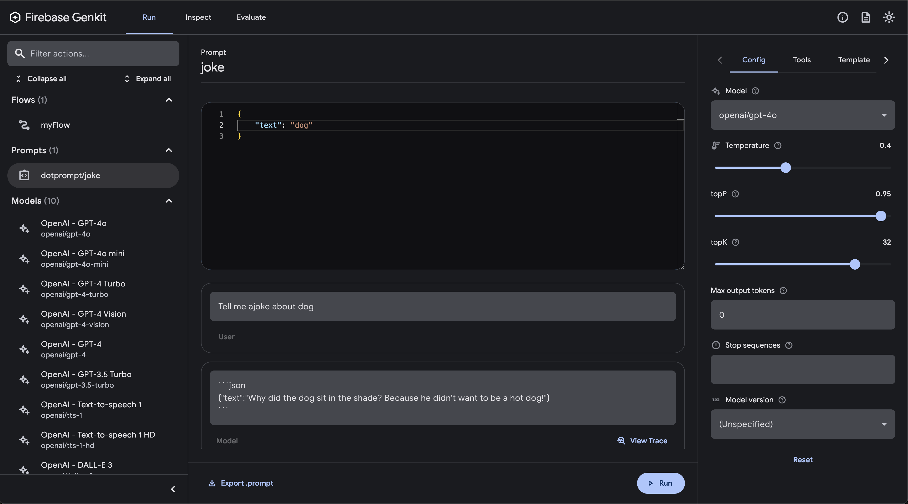

id: genkit-workshop
summary: Introductory workshop to Firebase GenKit
status: Published
authors: Xavier Portilla Edo
Feedback Link: https://github.com/xavidop/genkit-workshop
# Introduction to Firebase GenKit
<!-- ------------------------ -->
## Module 1: Introduction to the framework
Duration: 30
### Overview of Genkit


Firebase Genkit is an open source framework from the Firebase team that allows you to build generative AI applications with ease. It provides a set of plugins and libraries that help you to connect to large language models, manage prompts, create retrieval-augmented generation (RAG) models and many more.

In this workshop, you will learn how to use Genkit to build a simple generative AI application (Firebase function) that can answer questions about TBD. You will learn how to connect to a large language model, manage prompts, and talk to your PDF documents.

### Setting Up the Development Environment

Before you get started, let's set up our development environment. These are the tools you need to install for this workshop:
1. Node.js
2. Genkit CLI
3. Firebase CLI

The recommended development environment for Genkit is Node.js. You can download and install Node.js from the [official website](https://nodejs.org/).

To get started with Genkit, you need to install the Genkit CLI and set up a Firebase project. You can do this by following the instructions in the [Genkit documentation](https://firebase.google.com/docs/genkit):
```bash
npm install -g genkit-cli
```

You will also need to install the Firebase CLI and the Firebase emulator suite. You can do this by running the following command:

```bash
npm install -g firebase-tools
```

Before you can use the Firebase CLI, make sure you have a Fireabse account. Once you have create it, you need to log in to your Google account by running the following command:
```bash
firebase login
```


### Intialize our project

Since our application is going to be a Firebase function, you need to create a new Firebase project and initialize it with the Genkit plugin. You can do this by running the following command:

```bash
firebase init genkit
```
When prompted, select the follwing options:
1. **Please select an option:** Create a new project
2. **Genkit's Firebase integration uses Cloud Functions for Firebase with TypeScript. Initialize Functions to continue? (Y/n):** Y
3. **Do you want to use ESLint to catch probable bugs and enforce style? (Y/n):** Y
4. **Do you want to install dependencies with npm now? (Y/n):** Y
5. **Install the Genkit CLI globally or locally in this project?:** Globally
6. **Select a model provider:** None
7. **Would you like to update your tsconfig.json with suggested settings?** Overwrite
8. **Would you like to update your package.json with suggested settings?** Overwrite
9. **Would you like to generate a sample flow?** n

This will create a new Firebase project with the Genkit library initialized. you can now start building your generative AI application.

### Running the Firebase Simulator

To start the Firebase emulator suite, run the following command in the root directory of your Firebase project:
```sh
GENKIT_ENV=dev firebase emulators:start --inspect-functions
```
You can now access the Firebase emulator suite at [`http://localhost:4000`](http://localhost:4000). You can use the emulator suite to test your Firebase functions locally before deploying them to the cloud:


### Running the Genkit Developer Console

To start the Genkit developer console, run the following command in the root directory of your Firebase project:
```sh
genkit start --attach http://localhost:3100 --port 4001
```
You can now access the Genkit developer console at [`http://localhost:4001`](http://localhost:4001). You can use the developer console to interact with your generative AI application and test your prompts and flows:


### Solution

You can find the solution to this module in the `code/module1` folder of this [GitHub repository](https://github.com/xavidop/genkit-workshop)

<!-- ------------------------ -->
## Module 2: Hello World with Genkit
Duration: 30

### Creating a Genkit Flow
To create a new Genkit flow, you will to modify the existing code of the `index.ts` file in the `functions/src` directory of your Firebase project.

First, let's add the imports that we will need to create our Genkit flow:

```typescript
import {configureGenkit} from "@genkit-ai/core";
import {onFlow, noAuth} from "@genkit-ai/firebase/functions";

import * as z from "zod";
import {firebase} from "@genkit-ai/firebase";
```

This project uses the following Node.js Packages:
1. `@genkit-ai/firebase`: Genkit Firebase SDK to be able to use Genkit in Firebase Functions
2. `@genkit-ai/core`: Genkit AI Core SDK
3. `zod`: A TypeScript-first schema declaration and validation library


Perfect, let's intilize genkit in our project by adding the following code to the `index.ts` file:

```typescript
configureGenkit({
  plugins: [
    firebase(),
  ],
  logLevel: "debug",
  enableTracingAndMetrics: true,
});
```

This code initializes Genkit with the Firebase plugin and sets the log level to debug. One fo the cool is that it is based on a plugin architecture, so you can add more plugins to extend the functionality of Genkit.

You can now create a new Genkit flow by adding the following code to the `index.ts` file:
```typescript
export const myFlow = onFlow(
  {
    name: "myFlow",
    inputSchema: z.object({ text: z.string() }),
    outputSchema: z.string(),
    authPolicy: noAuth(), // Not requiring authentication, but you can change this. It is highly recommended to require authentication for production use cases.
  },
  async (toProcess) => {
    return toProcess.text;
  },
);
```
In the code above we are creating a new Genkit flow called `myFlow` that takes a text input with the JSON format `{text: 'myText'}` and returns the same text as output.

Let's build our project by running the following command in the `functions` directory:
```sh
npm run build
```

After building the project, let's run the Firebase emulator suite and the Genkit developer console to test our Genkit flow. We should be able to call the `myFlow` flow with the input `{text: 'Hello World'}` and get the output `Hello World`:
```bash
curl -X POST http://localhost:5001/<your-project-id>/<your-region>/myFlow -H "Content-Type: application/json" -d '{"data":{"text":"hi"}}'
```

You should get the following response:
```json
{
  "result": "hi"
}
```

You should see also the flow in the Genkit developer console:


### Connecting to an LLM
Right now, our Genkit flow is just returning the input text as output. Let's connect our Genkit flow to a large language model (LLM) to generate more interesting responses.

For this workshop, we will use the GPT-4o from OpenAI. Please create an account [here](https://platform.openai.com/):
.

Once you have created an account, you will need to create an API key. You can do this by going to the API keys section of the OpenAI platform and clicking on the "Create API Key" button in [Settings > API Keys](https://platform.openai.com/settings). You will need to copy the API key and save it in a secure location.

Once you have your API Key, we can install the OpenAI plugin for Genkit by running the following command in the `function` directory of your Firebase project:
```bash
npm install genkitx-openai
```

Let's import the OpenAI plugin library:
```typescript
import { configureGenkit } from "@genkit-ai/core";
import { onFlow, noAuth } from "@genkit-ai/firebase/functions";

import * as z from "zod";
import { firebase } from "@genkit-ai/firebase";
import { openAI } from "genkitx-openai";
```

Then, let's initialize the OpenAI plugin with:
```typescript
configureGenkit({
  plugins: [firebase(), openAI(
    {
      apiKey: <my-key>,
    }
  )],
  logLevel: "debug",
  enableTracingAndMetrics: true,
});
```

Now, we can create a new Genkit flow that connects to the GPT-4o model by adding the following code to the `index.ts` file:
```typescript
export const myFlow = onFlow(
  {
    name: "myFlow",
    inputSchema: z.object({ text: z.string() }),
    outputSchema: z.string(),
    authPolicy: noAuth(), // Not requiring authentication, but you can change this. It is highly recommended to require authentication for production use cases.
  },
  async (toProcess) => {
    const prompt =
    `Tell me ajoke about ${toProcess.text}`;

    const llmResponse = await generate({
        model:  gpt4o,
        prompt: prompt,
        config: {
        temperature: 1,
        },
    });

    return llmResponse.text();
  },
);
```

In the code above, we are creating a re-using the Genkit flow called `myFlow` that takes a text input with the JSON format `{text: 'myText'}` and generates a joke about the input text using the GPT-4o model. We are using the `generate` function from Genkit to generate the response. The `generate` function takes the model, prompt, and configuration as input and returns the generated text.

To use the `generate` function and `gpt4o`, we need to import it them:
```typescript
import { configureGenkit } from "@genkit-ai/core";
import { onFlow, noAuth } from "@genkit-ai/firebase/functions";

import * as z from "zod";
import { firebase } from "@genkit-ai/firebase";
import { gpt4o, openAI } from "genkitx-openai";
import { generate } from "@genkit-ai/ai";
```

Let's build our project by running the following command in the `functions` directory:
```sh
npm run build
```

Once built, let's run the Firebase emulator suite and the Genkit developer console to test our Genkit flow. We should be able to call the `myFlow` flow with the input `{text: 'dog'}` and get a joke about dogs:
```bash
curl -X POST http://localhost:5001/<your-project-id>/<your-region>/myFlow -H "Content-Type: application/json" -d '{"data":{"text":"dog"}}'
```

You should get a joke about dogs as the response:
```json
{
  "result": "Why did the dog sit in the shade? Because he didn't want to be a hot dog!"
}
```

After installing and configuring the OpenAI plugin, you will be able to interact with the models from the Genkit developer console:


### Solution

You can find the solution to this module in the `code/module2` folder of this [GitHub repository](https://github.com/xavidop/genkit-workshop)

<!-- ------------------------ -->
## Module 3: Prompt Management in Genkit
Duration: 30

### Prompt Templates using Dotprompt

Dotprompt is a powerful templating language that allows you to create dynamic prompts for your generative AI applications. You can use Dotprompt to create prompts that include variables, conditions, loops, and more. It uses handlebars-like syntax to define templates and variables.

It is very powerfuls allowing developers to separate the source code from the prompts, making it easier to manage and update the prompts without changing the source code.

To use Dotprompt in your Genkit flow, you need to install the Dotprompt plugin by running the following command in the `functions` directory of your Firebase project:
```bash
npm i @genkit-ai/dotprompt
```

Once we have the Dotprompt plugin installed, we can import it in the `index.ts` file:
```typescript
import { configureGenkit } from "@genkit-ai/core";
import { onFlow, noAuth } from "@genkit-ai/firebase/functions";

import * as z from "zod";
import { firebase } from "@genkit-ai/firebase";
import { gpt4o, openAI } from "genkitx-openai";
import { generate } from "@genkit-ai/ai";
import { dotprompt } from "@genkit-ai/dotprompt";
```

Then, we can initialize the Dotprompt plugin with:
```typescript
configureGenkit({
  plugins: [firebase(), dotprompt(), openAI(
    {
      apiKey: process.env.OPENAI_API_KEY!,
    }
  )],
  logLevel: "debug",
});
```

Now, It is time to create the `prompts`  folder in the `functions` directory of your Firebase project. This folder will contain the Dotprompt templates for your Genkit flows. You can create a new Dotprompt template by adding a new file with the `.prompt` extension to the `prompts` folder. Let's create a new Dotprompt template called `joke.prompt` with the following content:
```handlebars
---
model: openai/gpt-4o
input:
  schema:
    text: string
    entities: string
    user_input: string
output:
  format: json
  schema:
    text: string
---

Tell me ajoke about {{text}}
```

As you see above, the Dotprompt template defines the input and output schema for the prompt template. The prompt template defines the prompt that the Genkit flow uses to generate the response.

Let's modify our flow to use the Dotprompt template by adding the following code to the `index.ts` file:
```typescript
export const myFlow = onFlow(
  {
    name: "myFlow",
    inputSchema: z.object({ text: z.string() }),
    outputSchema: z.string(),
    authPolicy: noAuth(), // Not requiring authentication, but you can change this. It is highly recommended to require authentication for production use cases.
  },
  async (toProcess) => {

    const nluPrompt = promptRef("joke");

    const result = await nluPrompt.generate({
      input: {
        text: toProcess.text,
      },
    });

    return result.output();
  },
);
```

In the code above, we are using the Genkit flow called `myFlow` that uses the `joke.prompt` Dotprompt template to generate a joke about the input text. We are using the `promptRef` function from Genkit to reference the Dotprompt template and the `generate` function to generate the response passing the input text.

Make sure you update your imports to include the `promptRef` function:
```typescript
import { configureGenkit } from "@genkit-ai/core";
import { onFlow, noAuth } from "@genkit-ai/firebase/functions";

import * as z from "zod";
import { firebase } from "@genkit-ai/firebase";
import { openAI } from "genkitx-openai";
import { dotprompt, promptRef } from "@genkit-ai/dotprompt";
```

Let's build our project by running the following command in the `functions` directory:
```sh
npm run build
```

Once built, let's run the Firebase emulator suite and the Genkit developer console to test our Genkit flow. We should be able to call the `myFlow` flow with the input `{text: 'dog'}` and get a joke about dogs:
```bash
curl -X POST http://localhost:5001/<your-project-id>/<your-region>/myFlow -H "Content-Type: application/json" -d '{"data":{"text":"dog"}}'
```

You should get a joke about dogs as the response:
```json
{
  "result": {
    "text": "Why did the dog sit in the shade? Because he didn't want to be a hot dog!"
  }
}
```

You can interact with the Dotprompt templates in the Genkit developer console:


### Solution

You can find the solution to this module in the `code/module3` folder of this [GitHub repository](https://github.com/xavidop/genkit-workshop)

### What's next?

If you want to learn more about Dotprompt I will highly recommend you to play with:
1. Conditional statements using handlebars-like syntax
2. Use structured Input and output using JSON types to create more complex prompts.
3. Multi-message prompts
4. Multi-modal prompts

<!-- ------------------------ -->
## Module 4: Retrieval-Augmented Generation (RAG) with Genkit
Duration: 40
### Creating an indexer

### Creating an embedder

### Creating a retriever

<!-- ------------------------ -->
## Resources
